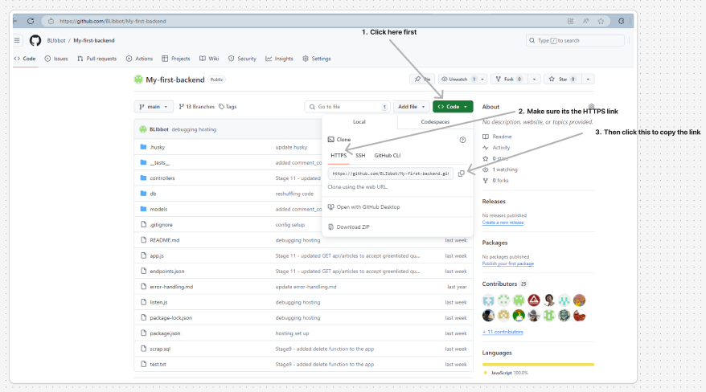

# Northcoders News API

<!-- prettier-ignore-start -->

Hosted version URL = https://my-first-backend-p0gm.onrender.com

Summary of what the project is:
This is my first ever backend, it was build throughout the backend block project week during my Northcoders bootcamp and based on everything I learned in the prior weeks.
The project had the ability to seed a test set for use locally, this contains a small amount of example information to ensure that the server will handle requests appropriatly.
There is also a development dataset which is an example of a more realistic (much larger) dataset which is used to seed our production enviroment being hosted by render via supabase.

To clone this project:
1) Create a new directory and name it however you see fit. 
2) Then in the terminal ensure you have navigated into the directory you wish to store this project in.
3) Get the URL link from the github project page.
   
4) When you are in the desired directory and have the github link use the command below. (remember to remove the square brackets)
    GIT clone [URL GOES HERE]
5) Navigate into the project directiory and type the command 
    code .

To run:
If you have cloned this repository and wish to run the project you must first create one or both of the following .env files,
.env.test && || .env.dev --please match the file name(s) exactly!

You can do this in the terminal with the following commands:

touch .env.test
touch .env.dev

Alternativly you can utilise VScodes explorer by either pressing the new file button or right clicking in the location you wish to store these files (in this case it should be the root of the directory - this is the main project folder containing all sub folders relevent to the project) and then typing the apropriate file name into the input bar.

Inside these files you will only need one line:

PGDATABASE=nc_news       --for the .env.dev database 
PGDATABASE=nc_news_test  --for the .env.test database

After one or both of these files are succesfully created you are ready to run the project.

To install the dependencies use the command below:
    npm install

To seed the local database and run tests use the following commands:
    npm run setup-dbs
    npm run seed
    npm test [test suite name you wish to run, leave blank to run all test suites]

The minimum (personally tested) versions of Node.js, and Postgres needed to run the project are:
Node.js version 22.7.0
Portgres version 8.7.3

---
This portfolio project was created as part of a Digital Skills Bootcamp in Software Engineering provided by [Northcoders](https://northcoders.com/)

<!-- prettier-ignore-end -->
